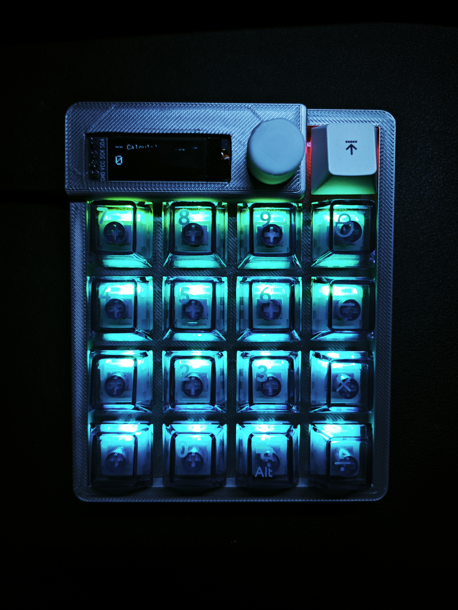

# EDA-Keypad 智能双模键盘

## 项目介绍

EDA-Keypad是一款多功能智能键盘，集USB数字键盘与独立计算器于一体，采用RP2040双核处理器，支持RGB灯光效果、OLED实时显示和旋钮调节等功能。

## 核心功能特性

- **双模式运行**: USB连接时作为数字键盘，断开连接时自动切换为独立计算器模式，智能识别工作状态。
- **RGB炫彩灯效**: 支持彩虹流光和跑马灯两种灯效模式，通过EC11旋钮可实时调节亮度，营造个性化氛围。
- **OLED实时显示**: 128x32 OLED屏幕实时显示工作模式、亮度信息、灯效状态和计算结果，操作状态一目了然。
- **智能计算功能**: 内置完整计算器功能，支持四则运算、小数计算、表达式解析，具备删除和清空功能。
- **双核心架构**: 基于RP2040双核处理器，核心1处理按键和USB通信，核心2负责显示和灯效，性能稳定。
- **EC11旋钮控制**: 高精度EC11旋转编码器，支持亮度平滑调节，带防抖动处理，操作手感优秀。

## 硬件规格

| 组件 | 规格 |
|------|------|
| 主控芯片 | RP2040双核处理器 |
| 按键数量 | 17键矩阵 |
| 显示屏 | 128x32 OLED显示屏 |
| LED灯 | 16个RGB LED |
| 接口 | USB Type-C |
| 控制元件 | EC11旋转编码器 |
| PCB尺寸 | 100mm x 100mm |

## 使用说明

### 键盘模式（USB连接状态）

1. 通过USB-C线连接到计算机
2. 系统会自动识别为USB HID设备
3. 作为标准数字键盘使用，兼容所有操作系统
4. 通过旋钮调节RGB灯效亮度
5. 同时按下"AC"和"DEL"键可切换灯效模式

### 计算器模式（USB断开状态）

1. 断开USB连接，自动切换为计算器模式
2. 支持标准四则运算及混合计算
3. 按键功能：
   - 数字键(0-9): 输入数字
   - 操作键(+,-,×,÷): 执行运算
   - "=": 计算结果
   - "AC": 清除所有输入
   - "DEL": 删除上一个输入
   - ".": 输入小数点

### RGB灯效控制

- **彩虹模式**: 色彩平滑过渡，旋钮控制亮度
- **跑马灯模式**: 色彩循环移动，旋钮控制亮度
- **恒亮模式**: 旋钮控制颜色选择

## 开发信息

### 开发环境

- Arduino IDE
- PlatformIO
- VS Code
- KiCad PCB设计

### 主要依赖库

- Adafruit_TinyUSB
- Adafruit_NeoPixel
- Adafruit_SSD1306
- Wire

### 固件更新

1. 按住BOOTSEL按钮的同时连接USB
2. 将新固件(.uf2文件)拖放到RPI-RP2出现的存储设备中

## 许可证

本项目采用MIT许可证。详情请参阅LICENSE文件。

## 项目链接

- [GitHub仓库](https://github.com/26516515111/-.git)